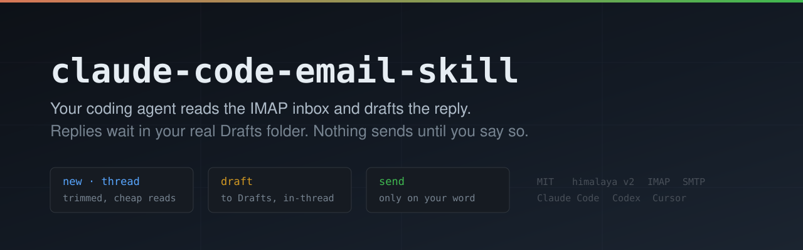

<p align="center">
  
</p>

<p align="center">
  <a href="LICENSE"></a>
  <a href="https://code.claude.com/docs/en/skills"></a>
  <a href="https://agentskills.io"></a>
  <a href="https://github.com/pimalaya/himalaya"></a>
  <a href="https://github.com/ph33nx/claude-code-email-skill/stargazers"></a>
</p>

# claude-code-email-skill

**Claude Code IMAP email, with a human on the send button.** This skill lets Claude Code, Codex, Cursor or any coding agent that reads `SKILL.md` files search and read a real IMAP mailbox from the terminal, save a threaded reply straight into the mailbox's own Drafts folder, and send it only when you say "send" for that exact message. It is a small stdlib Python wrapper over the [himalaya email CLI](https://github.com/pimalaya/himalaya) v2, not an email MCP server, so nothing stays running between calls and the password never enters the agent's config or context.

Full write-up with the design reasoning and every gotcha: **[Claude Code IMAP Email: The Agent Drafts, You Hit Send](https://abhishekchaudhary.com/blog/claude-code-imap-email-skill)**.

## What it does

- **Reads an inbox for the price of a summary.** One line per message; threads come back with quoted history, signatures, HTML and mobile footers stripped. A real 10-message Outlook thread dropped from 125,228 characters to 13,513.
- **Drafts on human approval.** The agent writes the reply once, into a markdown file you review. On "save" it lands in your Drafts folder, threaded, visible on your phone. On "send" it goes out, never in a batch.
- **Files the Sent copy.** SMTP never saves to Sent; this does, exactly once, and flags the original as answered.
- **Keeps threads intact in Gmail and Outlook.** Correct `In-Reply-To` and `References` (RFC 5322 section 3.6.4), headers built at 998 columns so long Outlook Message-IDs are not encoded away.
- **Refuses the classic reply-all mistake.** Replying to an older message would re-add people the conversation dropped, so `draft` insists on the latest message.
- **Zero resident memory.** A skill costs nothing until it runs. A local stdio email MCP server is one process per agent session, measured at 150 to 220 MB each.

## Install

Requirements: macOS or Linux (Windows: inside WSL), Python 3.11+, an IMAP and SMTP mailbox.

**Claude Code plugin marketplace** (recommended, updates with `/plugin`):

```
/plugin marketplace add ph33nx/claude-code-email-skill
/plugin install email@ph33nx
```

Then the two dependencies, himalaya v2 and the `markdown` package, at user level with no sudo:

```bash
curl -fsSL https://raw.githubusercontent.com/ph33nx/claude-code-email-skill/main/install.sh | sh -s -- --deps-only
```

**Any agent, via the [skills CLI](https://github.com/vercel-labs/skills):** `npx skills add ph33nx/claude-code-email-skill`, then the `--deps-only` line above.

**Manual:** clone the repo and run `./install.sh`. It installs the dependencies and copies the skill to `~/.claude/skills/email/`. Re-running it is safe.

## Connect a mailbox

1. Store the password in a file only you can read. Type it in a terminal, never in chat. Use an application password where your provider offers one:
   ```bash
   ( umask 077; read -rs P && printf %s "$P" > ~/.config/mail/work.pass )
   ```
2. Copy [`config.sample.toml`](config.sample.toml) to `~/.config/himalaya/config.toml`, `chmod 600` it, fill in your server and address, then check it:
   ```bash
   himalaya -a work account check   # imap: OK, smtp: OK
   himalaya -a work imap list       # your real Sent and Drafts folder names
   ```
3. Optional: copy [`ignore.sample`](ignore.sample) to `~/.config/mail/work.ignore` to hide receipts, DMARC reports and CI notices from `new`.

Ask your agent: **"any new mail?"**

## Commands

| Command | What the agent gets |
|---|---|
| `new` | Inbox since the last run, one line each (first run: unread). `--unanswered`, `--since YYYY-MM-DD`, `--all` |
| `search <query>` | Inbox and Sent together, newest first. `from:`, `to:`, `subject:`, `body:`, an address or a ticket id |
| `thread <id>` | One conversation, oldest first, trimmed to what each message said, 1,000 characters a message |
| `read <box:UID>` | One message, trimmed the same way |
| `draft reply.md --reply <box:UID>` | Markdown rendered to text and HTML, reply-all, threaded, saved to Drafts. `--dry-run`, `--replace` |
| `drafts` | What is waiting in Drafts |
| `send drafts:UID` | Sent over SMTP, Sent copy filed, draft removed, original flagged answered |

Every command takes `-a NAME` for the account and `-v` for full headers. The rules the agent follows live in [`skills/email/SKILL.md`](skills/email/SKILL.md).

## Gotchas it handles

- **himalaya v2 is not v1.** Most himalaya guides and agent skills still use v1 keys (`imap-host`) and commands (`template send`) that v2 removed. v2 uses `[accounts.<name>]` with `imap.*` and `smtp.*`, and has no `edit` or `delete`.
- **Outlook cuts `References` to the parent**, so `thread` also matches by subject and walks Message-ID links.
- **`Reply-To` is honoured**, so a reply to a contact-form notification reaches the customer.
- **`himalaya imap` subcommands take native folder names**, not aliases; the wrapper maps them.
- **Sending from a home machine puts your public IP in a `Received` header.** If that matters, route SMTP through a mail-only WireGuard peer (`AllowedIPs = <smtp server ip>/32`).
- Each himalaya call is a fresh IMAP login, about 2 seconds; independent calls run in parallel.

## Windows

Use WSL. Native Windows is untested, and the sample password command needs `sh`. The installer stops on Git Bash or MSYS and says so. Pull requests with a tested native path are welcome.

## Licence

MIT, see [LICENSE](LICENSE). [himalaya](https://github.com/pimalaya/himalaya) is a separate project under MIT OR Apache-2.0 and is not bundled.
